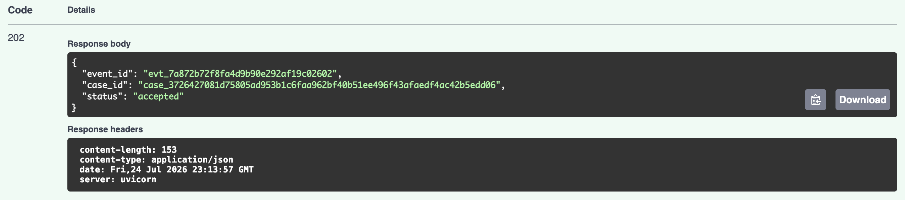
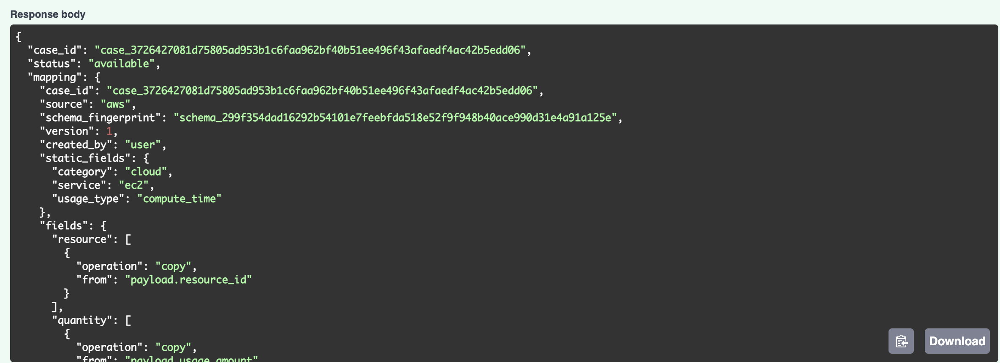
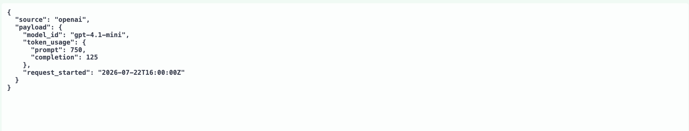

# UnifiedFlow demo

## Happy path

### 1. Submit the expected EC2 event

Input: [`expected_ec2_event.json`](../expected_ec2_event.json)

Result:

### 2. Check the EC2 mapping

Use `POST /mappings/resolve` with the EC2 input to retrieve the existing mapping.

Result:

The mapping is available and has `created_by: "user"`.

### 3. Submit the expected OpenAI event

Input: [`expected_openai_event.json`](../expected_openai_event.json)

The event uses the predefined OpenAI mapping.

### 4. View all normalized events

Use `GET /test/get-all-events`.

Result: [`get_all_events.json`](get_all_events.json)

The EC2 and OpenAI events share the same normalized structure, while each original source payload remains available in `raw_payload`.

## LLM normalization path

### 1. Submit the changed OpenAI event

Input: [`schema_drift_openai.json`](../schema_drift_openai.json)

Result:

This payload uses different field names from the predefined OpenAI schema.

### 2. View the normalized event

Use `GET /test/get-all-events` after the schema-drift consumer finishes.

Result: [`normalized_drift_event.json`](normalized_drift_event.json)

The generated mapping produces:

- `resource: "gpt-4.1-mini"`
- `input_units: 750`
- `output_units: 125`
- `usage_start: "2026-07-22T16:00:00Z"`

### 3. Check the generated mapping

Use `POST /mappings/resolve` with the changed OpenAI input to retrieve the generated mapping.

Result: [`drift_get_schema_result.json`](drift_get_schema_result.json)

The mapping is now available with `created_by: "ai"`.
